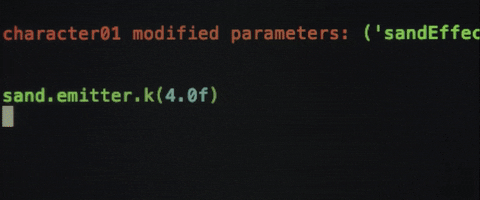

<h1 align="center">Hi there 👋 </h1>
<h3 align="center"> I'm Full Stack Developer</h3>

  

- ⚡Welcome to my GitHub! I'm a full-stack developer with a passion for turning ideas into seamless digital experiences. Whether it's front-end design or back-end functionality, I tackle every project with creativity and precision.**
- 👯 Let's Connect and Collaborate!
🌟 Explore My Projects: Discover innovative solutions and cutting-edge technologies in my repository.

🌟 Contribute: Have an idea or improvement? Feel free to fork my projects and submit a pull request. Your contributions are always welcome!

🌟 Hire Me: Looking for a full-stack developer to bring your vision to life? Contact me to discuss how we can work together.

<h3 align="left">Ready to dive in? Start exploring my work and let's create something amazing together! 🚀</h3>

<h3 align="left">Languages and Tools:</h3>

                                     

<picture>
  <source media="(prefers-color-scheme: dark)" srcset="https://raw.githubusercontent.com/tobiasmeyhoefer/tobiasmeyhoefer/output/github-snake-dark.svg" />
  <source media="(prefers-color-scheme: light)" srcset="https://raw.githubusercontent.com/tobiasmeyhoefer/tobiasmeyhoefer/output/github-snake.svg" />
  
</picture>

